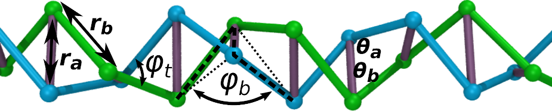

dlpdb
===========

##  Description

A collection of tiny scripts to help automate the process of downloading and
extracting coordinates, sequences, and secondary-structure information from
(a representative subset of) structures from the entire PDB library.

These scripts were originally used to estimate distances distances and angles
between specific atoms in proteins and DNA.  
The distribution of these distances and angles can be used to estimate
force-field parameters for coarse grained models for these biomolecules.
(Such as the DNA example shown above.)

## Requirements

The dlpdb tools requires the Bourne-shell, and a recent version of python
(2.7, 3.0 or higher), and can run on OS X, linux, or windows. (...if a
suitable shell environment has been installed.  See below.)

## Installation Instructions

There are two ways to install dlpdb:

## Installation using pip

If you are familiar with pip, then run the following command from within the directory where this README file is located:

    pip install .

Make sure that your default pip install bin directory is in your PATH.  (This is usually something like ~/.local/bin/ or ~/anaconda3/bin/.  If you have installed anaconda, this will be done for you automatically.)  Later, you can uninstall dlpdb using:

    pip uninstall dlpdb

Instructions for editing your PATH are included below.  

## Manual Installation method:

Alternatively, you can edit your PATH variable manually to include
the subdirectory where the dlpdb.sh script is located,
as well as the subdirectory where most of the python scripts are located.
Suppose the directory with this README file is named ``dlpdb''
and is located in your home directory:

If you use the bash shell, typically you would edit your 
`~/.profile`, `~/.bash_profile` or `~/.bashrc` files 
to contain the following lines:

    export PATH="$PATH:$HOME/dlpdb/dlpdb"
    export PATH="$PATH:$HOME/dlpdb/dlpdb/scripts"

##  Documentation

This directory should contain 3 folders:

    dlpdb/                        <-- source code
    doc/                          <-- README files
    examples/                     <-- examples of usage

dlpdb is not a single program or module, but a collection of many short
python and bash scripts that work together.  Documentation can be found
within the "doc" and "examples" directories.

## License

dlpdb is available under the terms of the [MIT license](LICENSE.md).
